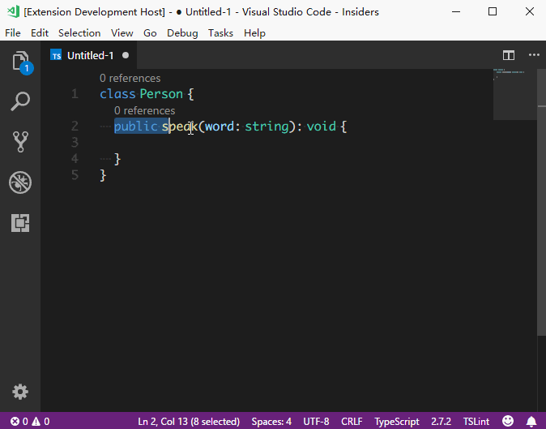

# Async Switch
> An easy way to switch a method/function async or not async/normal

## Command
* `Toggle Async`
    * select the method/function line you wanna toggle in a `*.ts` or `*.js` file
    * press `F1` and select the command
    * or use the shortcut key `ctrl+t ctrl+a` which means `T`*oggle* `A`*sync*

    

## Snippets
* `afun`
    > snippets for a new async function

    ```typescript
    async function foo(): Promise<void> {
        return new Promise<void>((resolve, reject) => {

        });
    }
    ```

* `amethod`
    > snippets for a new async method

    ```typescript
    public async foo(): Promise<void> {
        return new Promise<void>((resolve, reject) => {

        });
    }
    ```
